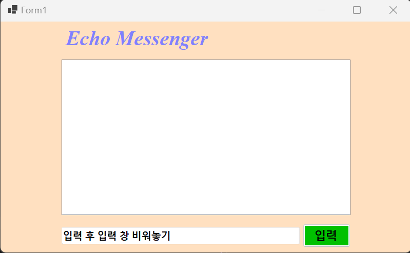
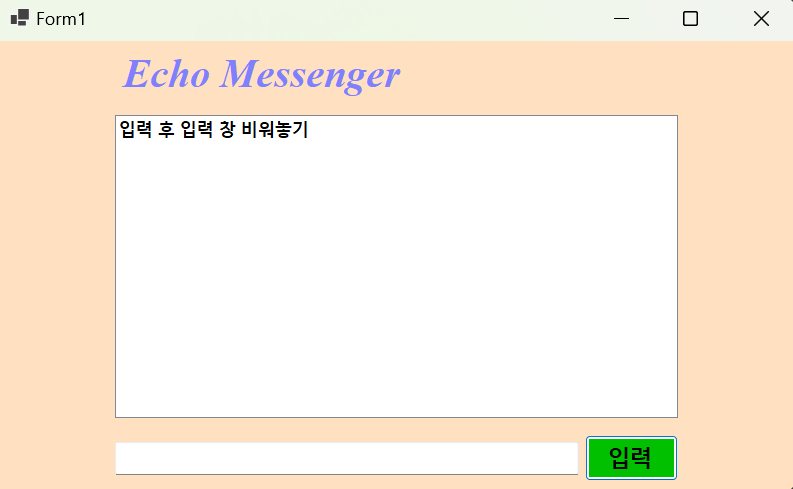
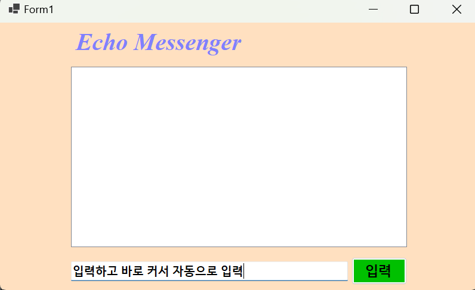
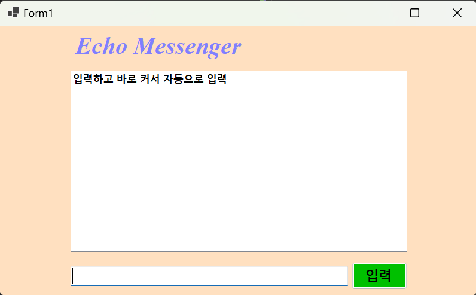
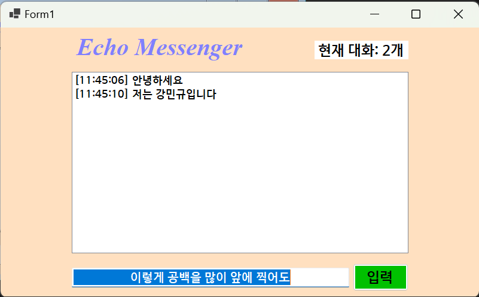
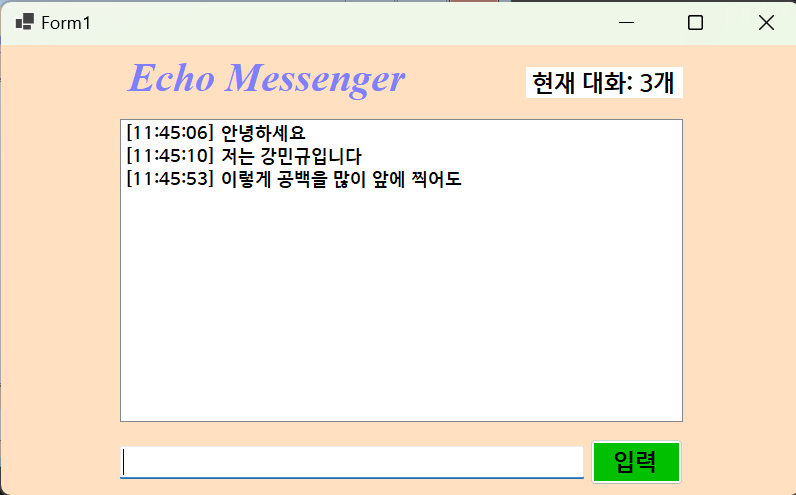
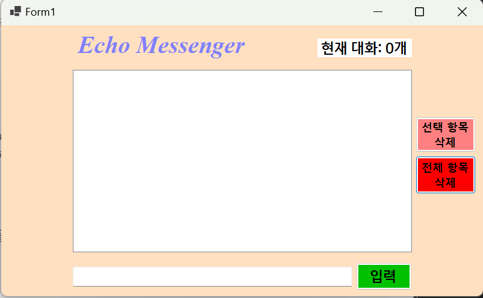
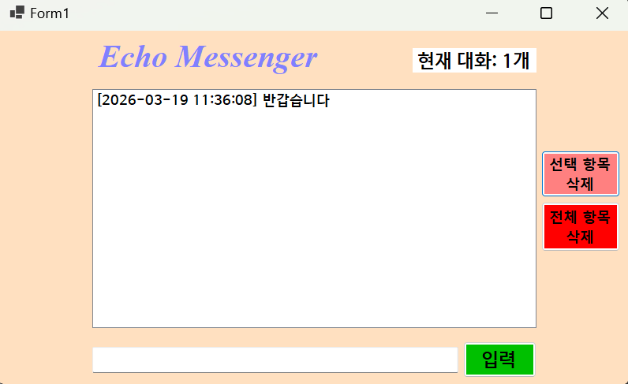
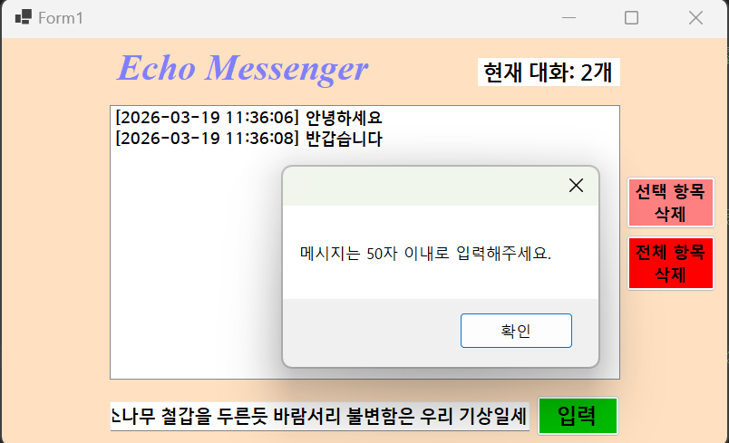

EchoMessenger

# (C# 코딩) 에코메신저

## 개요
-C# 프로그래밍 학습

### -1줄소개: 사용자의 키보드 입력을 받아서 리스트박스에 출력하고 관리하는 프로그램

### -사용한플랫폼: C#, .NET Windows Forms, Visual Studio, GitHub

### -사용한컨트롤: Label, TextBox, ListBox, Button

### -사용한기술과구현한기능: 
 
 - Visual Studio를 이용하여 WinForms UI 디자인 및 컨트롤 배치
 
 - string 클래스(Trim, IsNullOrWhiteSpace)를 이용한 사용자 입력 데이터 처리
 
 - DateTime 클래스를 이용한 현재 시간 정보 구하기 및 문자열 포맷팅
 
 - ListBox의 Items 속성을 활용한 데이터 추가, 삭제 및 초기화 로직 구현

 
### -수업중에배우고사용했던클래스들관련된설명
 
- Form: 윈도우 창을 생성하고 관리하는 기본 클래스
 
- String: 문자열 데이터를 처리하며, 공백 제거 및 유효성 검사에 활용
 
- DateTime: 시스템의 날짜와 시간을 가져오는 기능을 제공
 
- MessageBox: 사용자에게 알림이나 경고창을 보여주는 정적 클래스

 ### -실습중에구현한기능들설명
 
 - 텍스트 입력 및 리스트 항목 추가 기능
 
 - 엔터키 입력 시 자동 전송 및 입력창 포커스 유지 기능
 
 - 메시지 전송 시 타임스탬프 기록 및 데이터 가공 기능
 
 - 특정 항목 선택 삭제 및 전체 내역 초기화 기능
 
 - 입력 글자 수 제한(50자) 예외 처리 기능

## 실행화면(과제1)

### -과제1코드의실행스크린샷
 

### -과제내용

 - Label(표시), TextBox(입력), Button(전송), ListBox(대화창)를 적절히 배치합니다.

 - 전송 버튼 클릭 시 TextBox의 텍스트를 ListBox의 항목(Items)으로 추가합니다.

 - 추가 직후 TextBox의 내용을 비워(Clear) 다음 입력을 준비합니다.

### -구현내용과기능설명

 - 입력창에 메시지를 입력하고 전송 버튼을 누르면 메시지가 리스트박스에 표시된다.
 
 - 계속 반복하면 메시지가 리스트박스에 한 줄씩 계속 추가된다.
 
 - 추가 내용이 많아지면 리스트박스에 스크롤바가 자동으로 생기고 스크롤된다.

## -실행화면(과제2)
### -과제2코드의실행스크린샷

### -과제내용
 
 - 빈 메시지나 공백만 있는 경우 리스트에 추가되지 않도록 예외 처리를 수행합니다.
 
 - 메시지 전송 후 입력창(TextBox)에 자동으로 포커스가 유지되도록 설정합니다.
 
 - 엔터(Enter) 키 입력 시에도 전송 버튼을 누른 것과 동일하게 작동하도록 구현합니다.
### -구현내용과기능설명
 
 - 아무것도 입력하지 않고 전송을 눌러도 빈 줄이 생기지 않아 데이터 낭비를 방지한다.
 
 - 전송 후 마우스를 쓰지 않고도 연속해서 다음 메시지를 입력할 수 있어 편리하다.
 
 - 엔터키만으로 전송이 가능해져 실제 메신저와 유사한 사용성을 제공한다.

## -실행화면(과제3)

### -과제3코드의실행스크린샷

### -과제내용
 
 - 전송되는 메시지 앞에 현재 시간([HH:mm:ss]) 정보를 자동으로 추가합니다.
 
 - 입력된 텍스트의 앞뒤 불필요한 공백을 제거하는 Trim 기능을 적용합니다.
 
 - 하단 Label을 통해 현재 리스트에 쌓인 총 메시지의 개수를 실시간으로 표시합니다.

 ### -구현내용과기능설명
 
 - 메시지가 언제 기록되었는지 초 단위까지 확인할 수 있어 로그 기록에 용이하다.
 
 - 사용자가 실수로 넣은 앞뒤 공백을 제거하여 정돈된 형태의 데이터만 저장한다.
 
 - 하단 상태 표시줄을 통해 현재 대화가 총 몇 개인지 한눈에 파악할 수 있다.

## -실행화면(과제4)

### -과제4코드의실행스크린샷

### -과제내용
 
 - 리스트 박스에서 선택한 특정 항목을 삭제하는 기능을 구현합니다.
 
 - 전체 기록을 한 번에 지울 수 있는 초기화(Clear) 기능을 추가합니다.
 
 - 입력 가능한 글자 수를 50자로 제한하고, 초과 시 경고 메시지를 출력합니다.

### -구현내용과기능설명

 - 잘못 입력된 대화 내용을 선택하여 개별적으로 관리하거나 지울 수 있다.

 - 초기화 버튼을 통해 대화창을 깨끗하게 비우고 다시 시작할 수 있다.

 - 너무 긴 문장이 입력되어 UI가 깨지는 것을 방지하기 위해 50자 제한 예외 처리를 적용하였다.